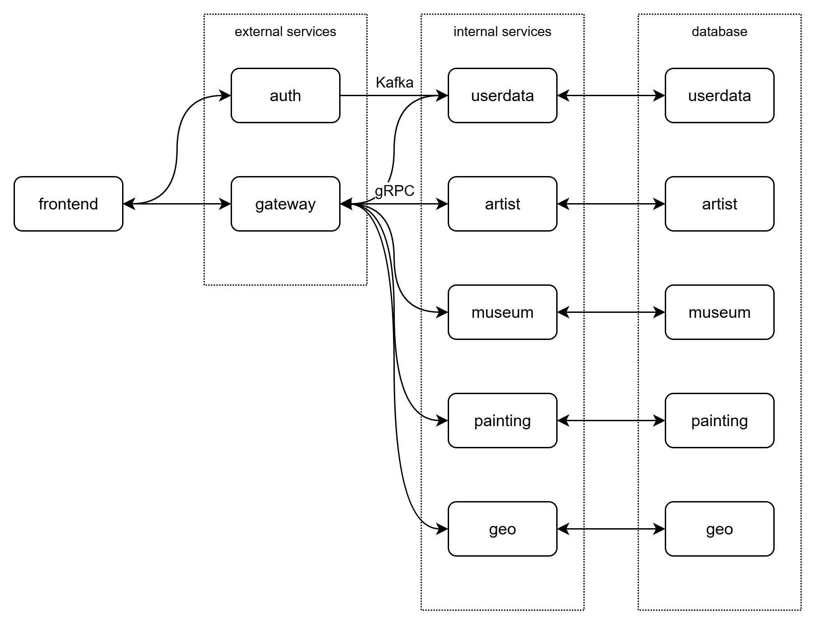

# Rococo

## todo

- [x] create services projects
    - [x] add `.proto` files for gRPC
    - [x] add unit tests
- [x] create tests project
    - [x] add REST tests
    - [x] add gRPC tests
    - [ ] add UI tests
- [x] containerize
- [ ] CI pipeline

## Локальный запуск

Сервисы и тесты запускаются локально, инфраструктура в docker-окружении. Для освобождения портов используйте скрипты `free-port.sh`/
`free-port.ps1`

### Запуск Postgres и Kafka

```bash
docker ps -aq --filter "name=rococo" | xargs -r docker rm -f
docker compose --profile env up -d
```

### Запуск frontend

```bash
npm --prefix rococo-client run dev  
```

Фронт доступен по адресу: http://localhost:3000/

### Запуск сервисов

```bash
./gradlew :rococo-auth:bootRun
./gradlew :rococo-gateway:bootRun
./gradlew :rococo-userdata:bootRun
./gradlew :rococo-geo:bootRun
./gradlew :rococo-artist:bootRun
./gradlew :rococo-museum:bootRun
./gradlew :rococo-painting:bootRun
```

## Запуск в docker

Сервисы и тесты запускаются в docker-окружении. Скрипт для сборки всех образов `docker-build.sh`

### Запуск сервисов

Запуск только сервисов без тестов

```bash
COMPOSE_PROFILES=env,modules docker compose up -d
```

Запуск всех сервисов и тестов

```bash
COMPOSE_PROFILES=env,modules,tests docker compose up -d
```

## Гибридный запуск

Сервисы запускаются в docker-окружении, тесты локально.

- тесты должны быть запущены с параметром `-Dtest.env=hybrid`
- необходимы алиасы для резолвинга имён в файле `/etc/hosts`

```
127.0.0.1 	rococo-auth
127.0.0.1 	rococo-gateway
127.0.0.1 	rococo-artist
127.0.0.1 	rococo-geo
127.0.0.1 	rococo-museum
127.0.0.1 	rococo-painting
127.0.0.1 	rococo-userdata
```

## Структура сервисов:




